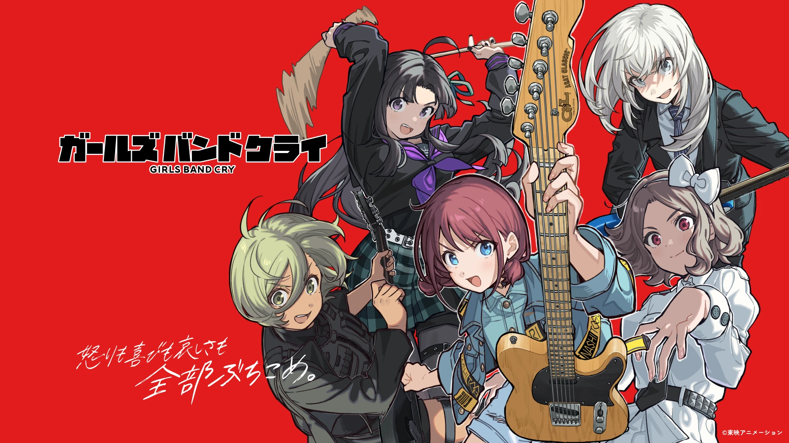
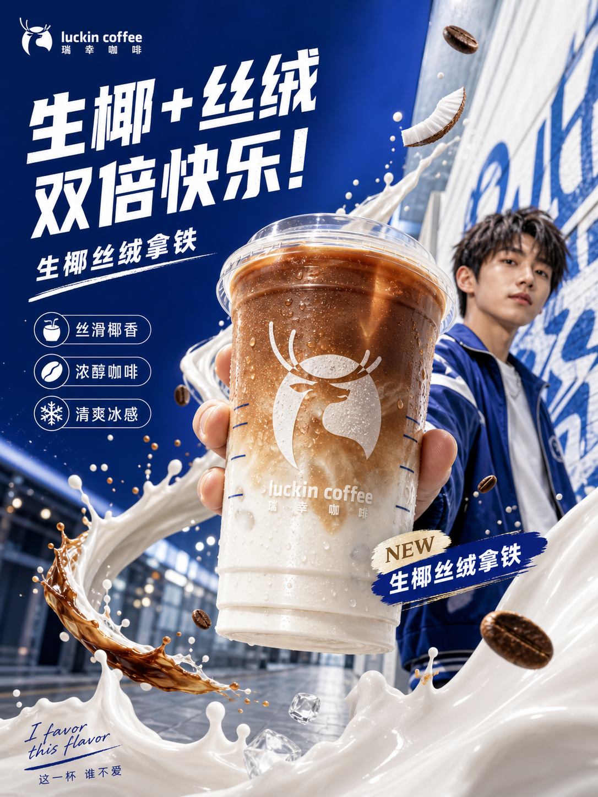
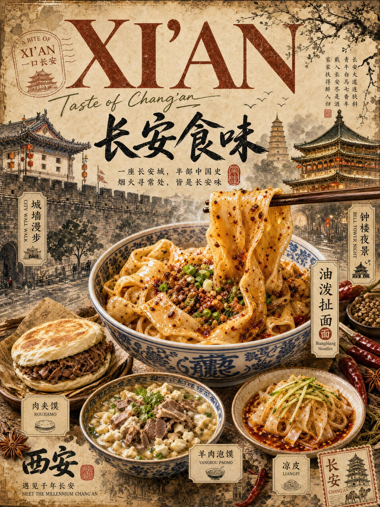
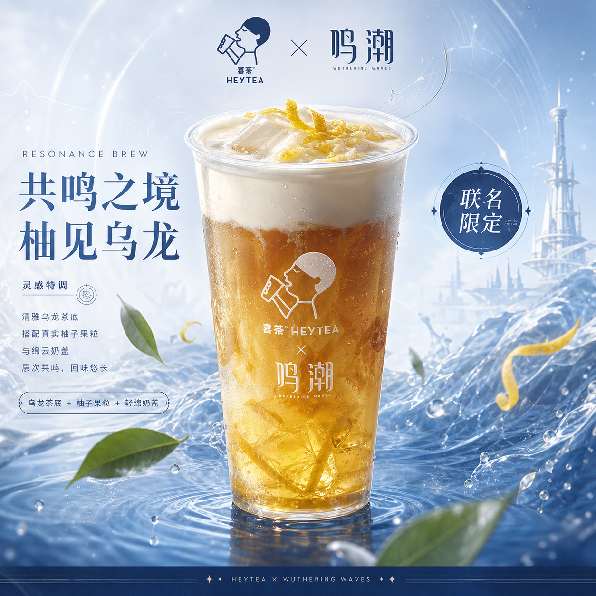
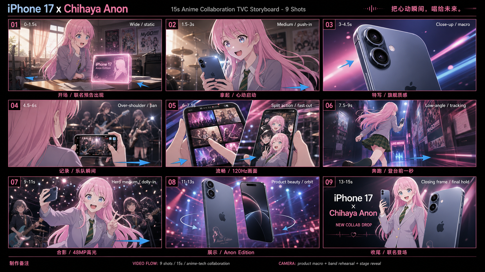
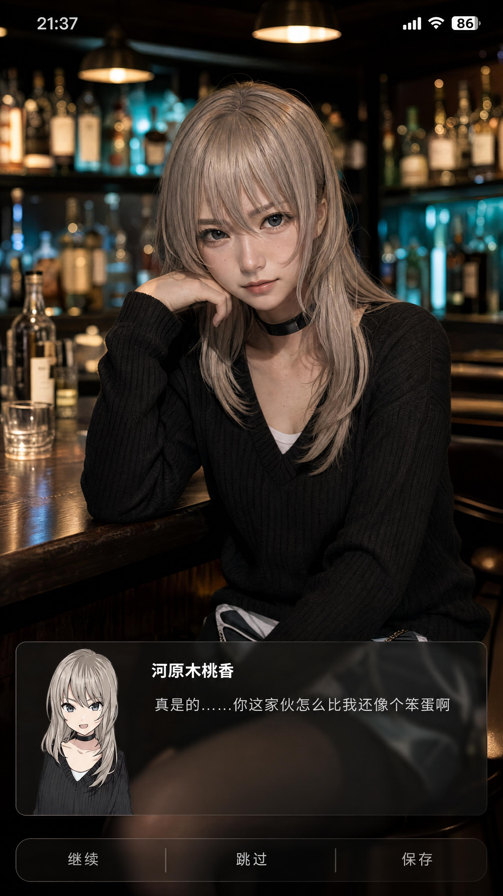

# togeari-imagegen

从模糊灵感到高质量出图 — 你的 GPT-Image-2 创意搭档

这是一个运行在 Codex 桌面端的基于 GPT-Image-2 模型的创意生图 AIGC Agent Skill 包。我们将整个创作流程拆解为五个关键模块与环节，并特别邀请了来自《GIRLS BAND CRY》里 TOGENASHI TOGEARI 乐队的五位成员——Nina、Momoka、Tomo、Rupa、Subaru——分别负责把关每一个关键 Skill 流程。她们会全程引导协助你把一个模糊的想法变成最终作品。

<p align="center">
  
</p>

## 它能做什么

你有一个模糊的灵感或者你希望把脑海中构思的画面变成完整的图片作品。你试着写 prompt，但写完总觉得差一点——要么画风偏离，要么构图奇怪，要么光影不对味。

从模糊想法到精准画面，需要静下心来梳理：你到底想要什么？什么样的提示词和参考素材能实现它？图出来了怎么继续优化？

现有的方式各有各的卡点：

| 常见做法 | 问题 |
|----------|------|
| 直接在 ChatGPT 里写 prompt | 手敲提示，没有灵感引导和质量保障 |
| 找 Prompt 模板| 杂乱繁多，且限制创意空间 |
| 让 AI 写提示词| 质量不稳定 |
| 讨论灵感用 A 工具、写 prompt 用 B 工具、生图用 C 工具 | 流程割裂，频繁切换工具导致灵感流失 |

**togeari-imagegen** 把创作拆成五个通用步骤，每个步骤交给一位 GBC 成员，帮你把模糊想法一步步落地成最终成片。从灵感收敛到 prompt 组装到生图到审阅，一站式完成。支持 Codex 桌面端、Claude Code、CoWork 等多平台运行。

## Case 展示

以下均为 togeari-imagegen 全流程协作生成。

| 瑞幸咖啡「生椰丝绒拿铁」新品广告 | 西安美食旅行海报「长安食味」 |
|:---:|:---:|
|  |  |
| 城市商业广告画风，产品特写 + 代言人构图 | 水墨国风排版，多道地方美食组合展示 |

| 鸣潮 × 喜茶联名宣传图 | Sony A7R VI 产品信息图 |
|:---:|:---:|
|  |  |
| 游戏 IP 联名茶饮，幻想世界观产品广告 | 结构化参数信息图，深色科技风格 |

| iPhone 17 × 千早爱音 TVC 九宫格分镜 | 河原木桃香 Coser × 对话框壁纸 |
|:---:|:---:|
|  |  |
| 动画联名广告分镜，9 个镜头批量生成 | 真人写真叠加动画风对话框 UI，9:16 竖屏 |

## 工作流程

你只需要说出想法，五位成员接力完成从灵感到成品的全过程。

### 🎵 成员分工

| 成员 | 位置 | Skill | 职责 | 性格 |
|:---:|------|-------|------|------|
| <br>**Nina** 井芹仁菜 | 🎤 主唱 | togeari-producer | 理解意图，追问收敛，编排流程 | 拒绝含糊，模糊的想法不往下传 |
| <br>**Momoka** 河原木桃香 | 🎸 吉他 | momoka-route | 给出多个创意方向 | 开朗、果断，专注于创意 |
| <br>**Tomo** 海老塚智 | 🎹 键盘 | tomo-map / tomo-scan | 从 Gallery 中发现创意方向、检索参考 prompt | 冷眼精准，严谨不将就 |
| <br>**Rupa** ルパ | 🎸 贝斯 | rupa-craft | 把 brief 和 Gallery 技巧智能整合成最终提示 | 冷静清醒，下笔精准不犹豫 |
| <br>**Subaru** 安和すばる | 🥁 鼓 | subaru-judge | 逐项审查生成结果，给优化建议和新灵感 | 好胜较真，每个细节都要查到位 |

### 流程

1. 🎤 **Nina 理解意图**。分析你的输入，判断是否需要追问。”帮我做张海报” 这种模糊输入她会追问收敛；已经足够具体的就直接跳到第 3 步。
2. 🎸 **Momoka 收敛方向**。根据意图生成 2-3 个视觉上有明显差异的方向，比如「极简排版」vs「实景氛围」vs「插画手绘」。你选一个继续。
3. 🎹 **Tomo 检索 Gallery**。从 9 个领域的核心技巧和 718 条验证 prompt 中检索匹配的参考方向与素材。
4. 🎸 **Rupa 智能组装 Prompt**。把创意方向、关键细节、Gallery 技巧融合成结构化的专业 prompt。不同领域不同的理念和写法。
5. 🥁 **Subaru 审阅**。对照 brief 逐项检查生成结果，给出具体优化建议，同时推荐同领域的其他创意方向。

单图满意后想做成系列，随时可以切到批量模式。同一风格不同内容、同一主体不同角度、叙事递进都支持，多张图并行生成。

### 智能调度

每位成员既可以在主对话流程中协作完成任务，也可以派出作为 subagent 独立执行专项任务。Nina 会根据任务复杂度智能判断：

- 灵感方向收敛需要参考 Gallery 领域知识 → Momoka 将作为 subagent，进行更专注的理解并提供更丰富契合的选项
- 跨多个领域检索领域 Gallery → Tomo 将作为 subagent，在后台完成检索，不占主对话上下文信息
- 复杂 brief 与 prompt 组装 → Rupa 将作为 subagent，专注 prompt 撰写润色，确保质量
- 详细的逐项审查 → Subaru 将作为 subagent，独立审图，不受干扰，不遗漏细节
- 批量生成多张图 → 激活多个 subagent 并行出图

## 领域指南 & Prompt Gallery

Skill 包内置覆盖多个领域的高质量 prompt，并对每个领域的提示词和真实案例进行深度分析，提炼出 **Creativity Map**（领域指南），总结该领域的创意方向和提示词关键技巧。Skill 会根据领域指南引导 Agent 真正理解”一份好的提示词应该怎么写”。

| 领域 | 数量 | 覆盖范围 |
|------|------|----------|
| Poster 海报 | 237 | 活动海报、音乐视觉、概念排版、新中式、书法 |
| Portrait 人像 | 196 | 电影光影、环境肖像、暗调情绪 |
| UI Design | 100 | App 界面、深色模式、仪表盘、电商首页 |
| Comparison 对比 | 60 | 前后对比、A/B 展示 |
| Ecommerce 电商 | 35 | 产品摄影、包装设计、手办渲染、日式零食 |
| Ad Creative 广告 | 34 | 产品广告、品牌视觉、电商详情页 |
| Infographic 信息图 | 22 | 教育科普、博物馆拆解、品牌系统、知识卡 |
| Character 角色 | 22 | 角色设定集、多角度一致性、拟人化设计 |
| Illustration 插画 | 12 | 纸艺场景、奇幻概念、混合媒介、漫画分格 |

通过与你的互动将灵感想法收敛到某个领域具体方向时，Skill 会自动匹配该领域最契合的技巧与参考案例，并结合 Image-2 生图特点，智能生成最佳提示方向；如果你的想法超出 Gallery 领域范围，Agent 会用深度提炼的通用技巧与你的意图深度融合，自主组装提示并产出图片。

## 安装

### Codex 桌面端

在 Codex 对话中说：

> 帮我安装 GitHub 上的 skill：github.com/KKL08/AIGC/togeari-imagegen

Codex 内置 Image Generation 功能，安装后即可使用，不额外产生 API 费用。如需精确控制尺寸、质量等参数，可在对话中切换到 API 模式（需配置 `OPENAI_API_KEY`）。

### Claude Code / CoWork

```bash
git clone https://github.com/KKL08/AIGC.git /tmp/aigc
ln -s /tmp/aigc/togeari-imagegen ~/.claude/skills/togeari-imagegen
```

需要配置 `OPENAI_API_KEY` 环境变量以启用生图。首次使用时 Skill 会引导完成配置。

详细安装方式 → [INSTALL.md](INSTALL.md)

## 后续 Roadmap

- [x] API 层集成与精细化生图参数控制（尺寸、质量、输出格式）
- [x] 跨平台支持（Claude Code / CoWork）
- [ ] 批量并发生成 + 透明背景后处理
- [ ] Gallery 自动更新迭代机制
- [ ] 创作偏好记忆系统
- [ ] 更多 Provider 支持（Google Gemini 等）

## 参考来源

- Prompt Gallery 数据来源于 [EvoLinkAI](https://github.com/EvoLinkAI/awesome-gpt-image-2-API-and-Prompts)、[ZeroLu](https://github.com/ZeroLu/awesome-gpt-image)、[YouMind](https://github.com/YouMind-OpenLab/awesome-gpt-image-2) 等开源社区
- 角色命名灵感来自《Girls Band Cry》（トゲナシトゲアリ / Togenashi Togeari）


